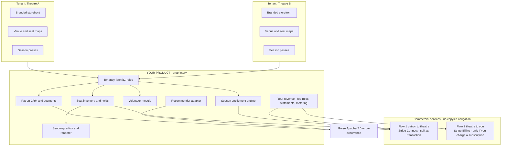

# Full System Recommendation — Community Theatre Ticketing, Volunteering, Marketing & Recommender

**Status:** Research complete — recommendation for decision
**Date:** 2026-09-17
**Scope:** A single system covering (1) ticket sales with **seat-map seat selection**, (2) **multiple venues**, (3) **season tickets that include seat selection**, (4) volunteer management, (5) marketing/patron CRM, (6) the recommender — and which the requestor can **sell to other community theatres**.
**Supersedes / extends:** `#Ticketing System.md`, `WordPress.md`, `CurrentSystem.md`, and the extraction-focused `RecommendationPath.md`.
**New binding constraint:** the eventual product is **commercially sold or charged for**, therefore every dependency's licence must permit commercial use in a sold product. This single constraint eliminates most of the open-source candidates.

---

## 1. Verdict in one page

**There is no open-source system — and no combination of them — that satisfies seat maps + multiple venues + season tickets with seat selection + a licence that permits resale.** This is not a research failure; it is the shape of the market. The four candidate families each fail on a different axis:

| Requirement | What exists | Why it fails for a resold product |
|---|---|---|
| Reserved seating with a **seat-map editor** | `seatchart.js` (MIT, dormant), `seatmap-canvas` (MIT, **v1 discontinued**), `Live Event Seating` (GPL, WordPress, very new), commercial services (`seatmap.io`, SeatLayer, seatmap.pro) | Either unmaintained, or GPL (source must ship), or pay-per-seat services you would have to rebill |
| **Multiple venues** per organisation | `EventSeats` (MIT, prototype), `OpenStage` (MIT, abandoned), WordPress plugins | Nothing mature; nothing multi-tenant |
| **Season tickets with seat selection** | `osConcert` (proprietary, £99), Tessitura/Spektrix-class systems (proprietary), `SeatShare` (season *sharing*, not selling) | The one open-source-shaped product with this feature is **not open source** |
| **Resale to other theatres** | `Hi.Events` Platform licence (€2,499/yr) is the only vendor that explicitly sells this | Base has **no reserved seating** — you build it |

**Recommendation: build your own product, and treat open source as components rather than a platform.** Specifically:

1. **Own the differentiated core** — seat inventory, seat-map editor, season-ticket entitlement engine, and multi-tenant tenancy. Nobody sells this; it is also the only part worth a moat.
2. **Take commodity layers under permissive licences** — headless commerce (MIT/BSD), payments (Stripe Connect, commercial API), recommender (Apache-2.0/MIT).
3. **Consider buying the multi-tenant ticketing chassis** from `Hi.Events` (Platform licence) as a **12–18 month accelerator**, not as the product — and only after confirming seat maps can be added.
4. **Do not build on** `pretix`, `Attendize`, `osConcert`, `OpenVolunteer`, or any AGPL/GPL product you intend to distribute — see §7 for the traps, including one vendor whose licence **explicitly bans SaaS**.
5. **Adopt the dual-licence model your own vendors use** (AGPL/community edition + paid commercial licence for resellers). `pretix` and `Hi.Events` are both living proof it works for this exact market — and it is the cleanest way to sell to community theatres without losing the code.
6. **Buy the money rails; do not build them.** Stripe Connect splits ticket money *at the transaction* (no billing engine), and **Stripe Billing** is only needed if you charge the theatres a subscription. The market-normal "free for the venue, buyer pays the booking fee" model removes the subscription problem entirely — see **§9.4**.

---

## 2. The resale constraint, stated properly

Licence risk in this project does **not** come from "is it open source?". It comes from two different legal mechanics that behave completely differently:

| How you deliver the product | What triggers the licence | Effect on copyleft (GPL/AGPL) code |
|---|---|---|
| **Pure SaaS** — theatres log in, you run everything | Generally **no distribution**, so no `conveying` | GPL/AGPL obligations largely *not* triggered — **except AGPL §13** (network use of a *modified* version requires offering the source to users) |
| **On-premise / customer-hosted / sold binaries** | Distribution of the software | GPL: full corresponding source to every customer. AGPL: same **plus** network-source obligations |

Consequences that drive the whole design:

- **AGPL is usable only if you are willing to hand your source to your customers and competitors.** For a product you intend to *sell*, that usually destroys the point.
- **GPL is workable for a hosted service you sell, and workable-but-limiting for on-premise.** If a customer self-hosts, they get the GPL source — including your modifications to GPL parts. Your proprietary code must be cleanly separated (a legal opinion is required; "plugin exceptions" and "aggregate vs derivative" are the whole question).
- **MIT / BSD / Apache-2.0 / LGPL** are the only licences that let you ship a closed product with no source obligation. **LGPL is uniquely useful** for an ERP-style base because it explicitly permits proprietary modules.
- **Attribution clauses are commercial costs, not just legal ones.** A mandatory "Powered by X" on a product a theatre is *paying you* for is a visible defect in the sale.
- **Vendor add-ons are a licensing dead end even when the core is permissive.** Odoo's reserved-seating modules and most WordPress seat-map add-ons are sold under proprietary terms (Odoo App Store `OPL-1`; WordPress Pro tiers) and **cannot be redistributed or resold**.

**Licence classes used in this document**

| Class | Verdict for a sold product |
|---|---|
| MIT, BSD-2/3, Apache-2.0 | ✅ Use freely, including in a closed product |
| LGPL-3.0 | ✅ Use as a library/platform base; your proprietary modules are permitted |
| GPL-2.0/3.0 | ⚠️ Hosted-service use is fine; distribution forces source disclosure |
| AGPL-3.0 | ⚠️/❌ Network copyleft — avoid in the core; only acceptable as an internally-run, *unmodified* service |
| AGPL + additional restrictions (pretix, Hi.Events) | ❌ as-is → ✅ **if** you buy the vendor's commercial licence |
| Custom non-commercial / attribution-only | ❌ for productisation (Attendize, and many "free" projects) |
| No licence file at all | ❌ legally unusable — default is "all rights reserved" |
| Proprietary / paid add-on (OPL-1, Pro tiers, seat-map SaaS) | ❌ as a build dependency; ⚠️ possible as a rebilled vendor service or OEM negotiation |

---

## 3. What was checked, and how

Every licence claim below was verified against the **actual `LICENSE` file** or **repository metadata** (licence identifier, last-push date, archive status) on **17 September 2026**. Feature claims come from the project's own README/product page. Where a claim is from marketing copy rather than the licence file, it is marked. Where something could not be verified, it says so — nothing here is inferred from reputation.

---

## 4. Ticketing, seat maps, venues, seasons

### 4.1 Arts/box-office specific

| Project | Licence (verified) | Seat maps | Multi-venue | Season tickets | Resell? | Reality check |
|---|---|---|---|---|---|---|
| **osConcert** v10.3 (CyberGord) | **Proprietary.** "© 2007–2026 osConcert. All rights reserved."; sold as a **£99 download** + PRO support from **$350** | ✅ Visual seat booking + [Seat Plan Maker] | Per-install only — no tenant/venue model | ✅ Advertised ("Season Tickets") | ❌ without a negotiated agreement | **The marketing contradicts itself:** the older `osconcert.co.uk` page still describes it as "a well-established open-source PHP ticketing platform" while `osconcert.com` sells it and reserves all rights. Treat as **commercial until the vendor supplies licence text in writing.** Single-developer supply risk. |
| **EventSeats** (`Hannah-goodridge/eventseats`) | **MIT** (README explicitly permits commercial use, modification, sub-licensing) | ✅ Interactive seat map, real-time availability | ✅ Claimed ("Multi-Venue Support") | ❌ | ✅ legally fine | **Prototype.** 11 stars, 1 contributor, ~1 year since last commit, no releases. Roadmap still lists email notifications, QR codes, Stripe (in progress) and a **seat-map editor**. Next.js/TS/Supabase. Excellent as a **MIT-licensed reference implementation** you may legally copy from. |
| **OpenStage** (`aav-andrei/theater-ticketing-system`) | **MIT** | ✅ Hall + seat layout + categories (Premium/Standard/Balcony) | ❌ (hall-level only) | ❌ | ✅ legally fine | Academic single-author project: 0 stars, no releases, last commit 8 months ago, PHP/MySQL, Romanian technical docs in-repo. **Useful domain model to copy, not a platform.** |
| **SeatShare** (`seatshare/seatshare-rails`, myseatshare.com) | Not verified (no licence confirmed) | n/a — tracks seats, not sales | n/a | ✅ **season-ticket *sharing*** among a group: packages → events → ticket holder → assignment requests | ⚠️ unverified | Not a ticketing system. Included because it is the only open project that models **season-ticket allocation and rotation** — exactly the semantics community theatres struggle with. **Verify the licence before copying anything.** |

### 4.2 General event ticketing (the realistic "chassis" candidates)

| Project | Licence (verified) | Reserved seating | Multi-tenant / resell | Notes |
|---|---|---|---|---|
| **Hi.Events** | **AGPL-3.0 with additional terms** — "Powered by Hi.Events" must be retained on pages and emails. **Commercial licences sold:** *Standard* €499/yr + VAT (own events, 1 domain, removes attribution); **"Platform" €2,499/yr + VAT** — *"agencies, SaaS founders and businesses running a ticketing platform for clients"*: unlimited organisations/client accounts, **SaaS admin dashboard, charge tenants fixed fees or percentages, host events on behalf of clients** | ❌ **Not in the feature set** (ticketing, promo codes, add-ons, tax/fees, QR check-in, Stripe Connect, refunds, REST API). They publish a free standalone "seating chart maker" tool — worth asking whether reserved seating is a roadmap item or an OEM module | ✅ **Vendor explicitly licenses the reseller model** | Active (commits within days), 4.0k stars, Laravel 13/PHP 8.3 + React 19 + PostgreSQL + Redis + Docker. **This is the only vendor in the market that will sell you the multi-tenant platform rights you need.** No seat maps is the gap. |
| **pretix** | **AGPL-3.0 with additional §7 terms that forbid SaaS.** The licence lists four prohibited purposes, including *"(a) Making the functionality of pretix available to third parties as a service (SaaS)"* and *"(b) Offering a service the value of which entirely or primarily derives from the value of pretix"*; attribution must remain and may not be removed | Partial (seating is not core) | ❌ **Licence prohibits the business model** | **Disqualified outright** — verify the wording yourself before someone re-proposes it as "the obvious choice". Older releases were Apache-2.0; that no longer helps you. |
| **Odoo 19 Community** | **LGPL-3.0** for Community (the repo's `LICENSE` mixes terms because Enterprise is proprietary) | ❌ None in core | ✅ LGPL permits **proprietary vertical modules** — the cleanest legal footing of any ERP base | Excellent for CRM, invoicing, subscriptions, POS, accounting, HR — **not** for seat maps. Reserved seating exists only as **third-party commercial Odoo modules** (e.g. Pokutsoft's *Event Ticketing & Reserved Seating*: seat maps, pricing zones, TTL holds, waitlist auto-promotion, best-available; Softhealer's *Event Seat Booking*). Those are **OPL-1/proprietary — you cannot resell them**. |
| **Attendize** | **Attribution Assurance License** (BSD-derived, requires *"Powered by Attendize"* or logo in verifiable form); white-label licence sold separately | ❌ | ⚠️ Needs a paid white-label licence | **Effectively dormant: last commit ~3 years ago, last release v2.8.0 ~3 years ago, 263 open issues, PHP 7.1/Laravel 6 era.** Do not start a 2026 product here. |
| **ERPNext** | **GPL-3.0** | ❌ | ⚠️ GPL | Active, huge, has a non-profit module with a `Volunteer` doctype. GPL distribution problem for a closed product. |

### 4.3 Seat-map engines and components (the hard part, and the differentiator)

| Option | Licence (verified) | State | Use it for |
|---|---|---|---|
| **`seatmap-canvas`** (`alisaitteke`) | **MIT** | ⚠️ **v1 explicitly "no longer developed"**; the maintained successor is the **commercial** `seatmap.io` platform (WebGL2 renderer + editor + booking). Framework-agnostic, React/Vue/Next wrappers, blocks, seat categories, custom backgrounds | **The most capable MIT seat renderer you can legally ship.** Fork it, accept that you own it now, and watch npm for security. |
| **`seatchart.js`** | **MIT** | Dormant (last push Oct 2023), 199 stars | Simpler alternative renderer; small and understandable, MIT |
| **Live Event Seating** (WordPress) | GPL (WordPress.org requirement — **confirm the plugin header**) | **Very new but very active:** published Dec 2025, v1.3.1 updated *hours* before this review, 20+ installs, 11 five-star reviews, 1/1 support topics resolved | **The most feature-complete seat-map system available under a free licence.** Free tier: drag-and-drop **venue builder** with theatre/banquet/classroom templates, tables/rows/stages/polygons, RSVP + free tickets, attendee dashboard, CSV, door check-in, WooCommerce seat-based ticket sales with tiered pricing, **5-minute seat locking**, Events Calendar/Gutenberg/Elementor integration. **Paid tiers (separate licence)**: GA areas, sections/balconies, waitlist, offline PWA scanner, seat release + refunds, seat transfer, group "find best seats", accessibility seats, multi-date events, Apple/Google Wallet, box-office/manual orders, venue-layout JSON import/export, PDF ticket designer. **Licence tiers go up to "Pro — unlimited websites".** | **Study it; and treat it as the strongest buy-vs-build benchmark.** Two caveats: GPL means anything you build on top must also be GPL (fine for a hosted service, not for a closed on-premise product), and the Pro features are proprietary. 20+ installs means **you would be an early adopter of a young plugin** — a real risk, and a real vendor conversation (ask about OEM/agency terms). |
| **Commercial seat engines** — `seatmap.io`, **SeatLayer**, `seatmap.pro`, Ticketseat | Proprietary | Mature | Only as **rebilled vendor services or an OEM negotiation**. SeatLayer markets **per-sold-seat** pricing (you must rebill it and it eats margin); `seatmap.pro` markets on-premise + REST API + "no per-seat fees"; Ticketseat markets 60-second seat locking. **Per-seat pricing is incompatible with a product you resell** unless the theatre pays it. |

### 4.4 Season tickets with seat selection

**Nothing open source does this.** Verified absences: `Hi.Events` (no seats), `EventSeats` (no subscriptions), `pretix` (vouchers, and it is licence-excluded anyway), `Attendize`/`ERPNext`/`Odoo` (no seat-level subscriptions), `OpenStage` (no subscriptions), `SeatShare` (allocation only, no sales, licence unverified).

The two commercial systems that *do* it are `osConcert` (Season Tickets, £99, proprietary) and the enterprise arts platforms (Tessitura, Spektrix, Ticketsolve, On The Stage, TicketPeak, ThunderTix, Ludus and similar) — all proprietary, all competitors, none resellable without a partnership deal.

**This is the single biggest build item and the strongest source of product differentiation.** See the domain model in §9.2.

---

## 5. Volunteer management

| Project | Licence (verified) | State | Verdict |
|---|---|---|---|
| **OpenVolunteer** (openvolunteer.net → `minnesota-furs/mnfursvolunteers`) | ❌ **No licence file. Repository metadata: `license: null`.** Despite the marketing claim "open source" / "Free & open source on GitHub", **there is no licence**, so default copyright applies | Active (commits Sept 2026), 1 star, 7 forks, Laravel + Blade | **Do not copy, fork, or ship this.** Feature-wise it is the closest match to the brief — volunteer events & shifts, self-service shift claiming with capacity/permissions, departments/teams, approved-hours records, **perk/recognition milestones**, staff openings, digital check-in, announcements, multi-program reporting, plus managed hosting. Use it as a **requirements checklist only**, then build or licence properly. |
| **OpenVolunteerPlatform** (`aerogear`) | **MIT** | ❌ **Abandoned ~6 years ago** (last commit 2020/21) | MIT is perfect; the project is dead. No security maintenance → unusable. |
| **ERPNext Non-Profit** | GPL-3.0 | Active | Volunteer doctype + attendance. GPL problem for a closed product. |
| **Odoo Community** | LGPL-3.0 | Active | No volunteer app, but LGPL + a modular ORM means **a proprietary volunteer module is legal**. Solid home for hours/rostering if you are already on Odoo. |
| **Kimai** | **AGPL-3.0** | Active | Time tracking per volunteer — AGPL, so avoid in the core. |
| **CiviCRM + CiviVolunteer** | **AGPL-3.0** (CiviCRM verified) | Active | Full non-profit CRM with volunteer scheduling; AGPL is the blocker for a sold product. |

**Verdict:** the volunteer domain is **thin, and the one promising project is legally unusable**. Volunteer management is also *simple* compared with seat inventory — opportunities → shifts → signups → hours → recognition, joined to the same person record as patrons. **Build it** (roughly 3–5 weeks of the roadmap; the identity link to the patron record is the valuable part, since a volunteer is usually also a ticket buyer).

---

## 6. Marketing, CRM and the recommender

### 6.1 Marketing / patron CRM

| Project | Licence (verified) | Verdict |
|---|---|---|
| **Mautic** | **GPL-3.0** ("Mautic is released under the GPL v3"; trademark of the Mautic project / Open Source Collective) | The most complete open-source marketing automation suite (campaigns, segments, email, forms, scoring). **Operate it unmodified as an internal service** and it is defensible; **ship or modify it in a sold product and the GPL follows you.** Note the trademark. |
| **Krayin** | **MIT** ✅ | Active (Sept 2026), 23.9k stars, Laravel CRM; repo topics include `crm-multi-tenant-saas`. The **licence-clean CRM choice** if you need a patron/stakeholder CRM you can extend proprietary. |
| **Odoo Community CRM** | LGPL-3.0 ✅ | Best combined footing if you already adopt Odoo for back-office: CRM + subscriptions + invoicing + POS in one LGPL base with proprietary modules. |
| **Listmonk** | **AGPL-3.0** | Excellent newsletter engine; AGPL. Acceptable only as an unmodified internal service. |
| **EspoCRM / SuiteCRM** | GPL-3.0 / AGPL-3.0 (not individually re-verified this pass) | Same copyleft caveats; not obviously better than Krayin or Odoo here. |

**Verdict:** patron CRM and segmentation should live **inside your own product** (you need patron, purchase, volunteer and seat history in one place — that *is* the product). Use Mautic-style campaign logic as a feature to emulate, and pick **Krayin (MIT)** or **Odoo (LGPL)** if you buy rather than build.

### 6.2 Recommender

The prior analysis in `RecommendationPath.md` stands up well; the licensing picture confirms it.

| Engine | Licence (verified) | State | Verdict |
|---|---|---|---|
| **Gorse** | **Apache-2.0** ✅ | Active | **Recommended.** REST ingestion, bulk JSONL, TTL for items and positive feedback (vital when a theatre's catalogue rotates every few weeks), non-personalised + item-to-item fallbacks for cold start, Docker/single-node. Apache-2.0 means you may embed or resell it. Design note: multi-tenancy is by **separate instance or ID namespacing** — plan it, don't discover it. |
| **LightFM** | **Apache-2.0** ✅ | Slowing (last push Jul 2024) | Hybrid content + collaborative filtering — the best fit for *sparse* community-theatre data because you can feed genre/era/family-friendly features directly into the model. |
| **implicit** | **MIT** ✅ | Active (2026) | Fast implicit-feedback factorisation; good second opinion / benchmark |
| **RecBole** | **MIT** ✅ | Active (2025) | Research-grade breadth; useful for offline evaluation of candidate models |
| **PredictionIO** | Apache-2.0, **retired** (Attic, Apr 2021) | ❌ | Still correctly struck out in the existing notes. |

**Verdict:** identical to the earlier recommendation, and now licence-clean for a sold product: **run item-to-item co-occurrence and content/genre matching first** (one SQL query — no ML infrastructure, no second server), and add **Gorse (Apache-2.0)** when the pipeline is proven. Do not let the recommender drive the platform choice.

---

## 7. Licence traps — the "do not build on this" list

| # | Trap | Why it kills the resale plan | Evidence |
|---|---|---|---|
| 1 | **pretix** | AGPL-3.0 **plus additional terms that explicitly prohibit providing its functionality as a service to third parties** — i.e. the exact business model | Its own `LICENSE` |
| 2 | **osConcert** | Sold product, "All rights reserved"; the "open source" claim survives only on a legacy marketing page | Vendor's own download page + footer |
| 3 | **Attendize** | Attribution Assurance Licence + white-label fee, **and the project is ~3 years dormant** on EOL PHP/Laravel | `LICENSE` + repo metadata |
| 4 | **OpenVolunteer** | **No licence file at all** → all rights reserved, despite "open source" marketing | GitHub API `license: null` |
| 5 | **OpenVolunteerPlatform** | MIT, but abandoned ~6 years | Last commit 2020/21 |
| 6 | **AGPL components in the shipped core** (CiviCRM, Kimai, Listmonk, Hi.Events-as-is) | Network-use source obligation if modified; distribution obligation if shipped | Licence texts |
| 7 | **GPL components in a closed on-premise product** (Vendure, ERPNext, Mautic-as-a-component, WordPress plugins) | Every customer receives the source | Licence texts |
| 8 | **Proprietary add-ons** (Odoo OPL-1 seat modules, WordPress "Pro" seat tiers, `seatmap.io`, SeatLayer) | Cannot be redistributed or embedded; per-seat pricing destroys margin | Vendor terms |
| 9 | **Unverified "open source" claims** generally | Default copyright is "all rights reserved" | — |

**Two additional non-licence traps worth naming:** (a) **single-maintainer dependencies** (`osConcert`, `Live Event Seating`, `seatchart.js`) are supply risk you will be reselling as reliability; (b) **"open core" vendors can relicense or reprice** — the dependency you take today at €499/yr may be €4,999/yr in three years. Fast-growing AGPL+commercial vendors (Hi.Events, pretix) both demonstrate this pattern.

---

## 8. Recommended architecture

### 8.1 Option A — Build on a permissive commerce core *(recommended)*

| Layer | Choice | Licence | Why |
|---|---|---|---|
| Commerce/orders/catalog/promotions/tax | **Medusa v2** (MIT except clearly-marked Enterprise Edition materials) **or Saleor** (BSD-3-Clause) | ✅ | Both active, both headless API-first, both avoid copyleft. Saleor is Python/GraphQL; Medusa is TypeScript. Choose on your team's language, not on features. |
| Payments | **Stripe Connect** — each theatre is merchant of record, you take a platform fee | Commercial API, no OSS obligation | Solves the hardest multi-tenant problem: **you must not be the merchant of record** for other theatres' ticket money. |
| Your own revenue (theatre → you) | **Not a build item.** Fee deduction via Connect (no billing engine needed), or **Stripe Billing** if you charge a subscription; **OpenMeter** (Apache-2.0) ✅ if you must self-host usage metering | Commercial API; OpenMeter Apache-2.0 | See **§9.4** — never write proration, dunning or tax logic |
| Seat renderer | Fork **`seatmap-canvas` (MIT)** or **`seatchart.js` (MIT)** | ✅ | MIT lets you ship it closed. Budget for owning it. |
| Seat-map **editor** | **Build.** | — | Nobody licences this permissively; it is your differentiator. |
| Seat inventory, holds, best-available, exchanges | **Build.** | — | TTL holds, double-sell prevention, price zones, accessible + companion seats, subscriber exchange windows. |
| Season entitlement engine | **Build.** | — | §9.2. |
| Multi-tenancy | **Build.** | — | §9.3. |
| Volunteer | **Build** (small) | — | §5. |
| CRM / segments | **Build** on your own data, or **Krayin (MIT)** | ✅ | Patron + purchase + volunteer + seat history in one place *is* the product. |
| Back office (optional) | **Odoo 19 Community** | LGPL-3.0 ✅ | Only if you want accounting/invoicing/subscriptions/POS off the shelf with proprietary modules on top. |
| Marketing automation | Own campaign/segment features; optionally **Mautic unmodified, internal only** | GPL-3.0 ⚠️ | Do not embed or modify in the sold artifact. |
| Recommender | **Co-occurrence + content matching first**, then **Gorse (Apache-2.0)** | ✅ | Exactly as `RecommendationPath.md` concludes, now licence-verified. |

**Pros:** no copyleft in the shipped artifact; full freedom to price, white-label and relicense; you own the moat. **Cons:** you build ticketing, seats, seasons and tenancy — realistically **9–14 months** with 2–4 developers.

### 8.2 Option B — Buy the platform chassis, build the seat/season layer *(accelerator)*

Take **Hi.Events** under its **Platform licence (€2,499/yr + VAT)**, which already grants: unlimited organisations/client accounts, a SaaS admin dashboard, **charging tenants fixed fees or percentages**, and hosting events on behalf of clients. Build the seat-map + season-ticket module onto it.

**Pros:** you skip 4–6 months of ticketing/commerce/REST-API/QR/stripe-connect work, and the vendor's terms are *written for exactly your business model* — which is rare and worth paying for. **Cons:** the base has **no reserved seating**, so you still build the hardest part; you inherit a PHP/Laravel + React stack and a single-vendor dependency; and you must confirm in writing that (a) reserved seating is permitted to be added and (b) your module may remain proprietary. **First question to the vendor: "do you have an OEM/seat-map module, or is reserved seating on the roadmap?"**

### 8.3 Option C — WordPress + WooCommerce + Live Event Seating *(fastest to first paying theatre, weakest as a product)*

Live Event Seating Lite (GPL) + WooCommerce gives you real drag-and-drop seat maps, tiered pricing, 5-minute seat locking, RSVP, ticketing and check-in **today**, with a paid tier that is already licensed for **unlimited websites** — which is a defensible way to *operate* a hosted service for many theatres. **But:** GPL covers everything you write on top, WordPress multisite tenanting is operationally fragile at scale, and the Pro features you would want are proprietary. **Verdict: use it to validate demand with your own theatre, not to build the product.**

### 8.4 Recommendation

**Run Option C now (weeks, not months) to keep selling tickets at your own theatre and to pressure-test the seat-map UX cheaply. Build Option A as the product. Keep Option B as a priced fallback if speed-to-market beats ownership — and get a legal opinion before committing either way.**

---

## 9. The three genuinely hard domain problems

### 9.1 Seat inventory across multiple venues

- **Model:** `Organisation → Venue → Auditorium → SeatMap (versioned) → Section/PriceZone → Row → Seat`. Performances reference a **`SeatMapVersion`**, never the live map — otherwise editing a venue's layout silently corrupts historical bookings.
- **Never mutate a seat map in place** once a performance has sold a seat. Version it; migrate deliberately.
- **Holds with TTL** at the database level (a `seat_hold` row with `expires_at`, plus a unique constraint on `(performance_id, seat_id)` across confirmed tickets) — this is where naive builds double-sell. Live Event Seating's 5-minute lock and Ticketseat's "60-second locking" exist precisely because this is the failure mode.
- **Best-available / adjacent-group selection** is a server-side algorithm, not a UI nicety, and it is what box office staff actually use by phone.
- **Non-sellable seats** (blocked, sightline-restricted, technical), **accessible + companion pairs**, and **house-held** seats per performance.

### 9.2 Season tickets that include seat selection

This is a **package of entitlements**, not a ticket. Model it as:

| Concept | Meaning |
|---|---|
| `SeasonPackage` | e.g. "2027 Main Season — 5 shows, 2 seats, Balcony" |
| `Entitlement` | One redeemable right to *N* seats in a *price zone* for a *show* (or any show in a set) |
| `RedemptionWindow` | Opens/closes per show (subscribers pick before public on-sale, then the window closes so unsold holds release) |
| `SeatAssignment` | The chosen seat(s) for that redemption — a normal booking, flagged `subscriber` |
| `ExchangePolicy` | Rules for swapping a claimed seat later, with fees and cut-off times |
| `Renewal` | Annual re-offer, seat-retention priority ("keep my seats"), payment plan |

Design requirements the commercial systems all share and DIY builds always miss: **seat retention on renewal**, **pre-sale priority ordering** (longest-tenure subscribers first), **partial redemption** (subscriber claims 3 of 5 shows), **upgrade paths** (Balcony → Stalls with a price difference), **payment plans** (instalments before the season starts), and **release of unclaimed entitlements** back to general sale on a deadline. Because your requirement is seats **across venues**, the entitlement must be scoped to `(organisation, season)`, not to a venue.

### 9.3 Multi-tenancy (the part that makes it a business)

- **Isolation:** single database with a mandatory `organisation_id` on every table and row-level scoping enforced in the data layer — plus tests that fail if a query forgets the tenant predicate. Separate schemas per tenant are safer but much harder to operate at small-theatre scale.
- **Identity:** one human may be a patron of several theatres. Keep accounts **per tenant** (a patron of Theatre A must not be visible to Theatre B), even if they reuse the same email. Cross-tenant data pooling is the thing that will get you sued.
- **Branding:** per-tenant domain (`tickets.theatre.org`), logo, colours, email templates, sender identity.
- **Billing:** **the theatre's ticket money must never touch your balance.** What you actually need here depends on your revenue model — under the buyer-paid booking fee there is no billing system at all, just fee rules and a statement. See **§9.4**.
- **Data protection:** you are a **processor** for each tenant's patron data and a **controller** for your own account data. That means a DPA per tenant, per-tenant export and deletion (the volunteer and marketing modules make this a GDPR right-to-erasure path, not an afterthought), sub-processor disclosure, and a retention policy.
- **PCI:** use hosted/iframe card fields (Stripe Elements/Checkout) so the card data never touches your infrastructure. Do not let a well-meaning volunteer "just add a payment form".
- **Exit:** per-tenant full export. Community theatres have been burned by proprietary vendors; being able to leave is a selling point you can put on the pricing page.

### 9.4 Money flows — two separate problems, only one of which needs "billing"

§8 originally flattened these into one payment node. They are worth separating explicitly, because **only one of the two flows needs anything resembling a billing system** — and the cheap, saleable revenue model removes it entirely.

| Flow | Who pays whom | What it actually needs | Build or buy? |
|---|---|---|---|
| **1. Patron → Theatre** (ticket money) | Patron pays the **theatre**; the theatre is merchant of record | **Stripe Connect.** The split happens at the transaction: your cut as `application_fee_amount`, the theatre's share settled to its own account. Tax/VAT on tickets is the theatre's obligation (Stripe Tax can compute it) | **Do not build a ledger of ticket money.** Stripe is the ledger. You build **fee rules** (per ticket, per booking, percentage, capped) and **a monthly statement the theatre can trust** |
| **2. Theatre → You** (your revenue) | Only exists if you charge a **subscription or flat platform fee** | **Stripe Billing** — hosted checkout, customer portal, invoices, proration, dunning, retries — or a **merchant of record** (Paddle, Lemon Squeezy) that also carries global VAT on your SaaS fees | **Buy it.** Never write proration, dunning, retries, credit notes or tax determination yourself |

**Direct answer to "would this be a paid service?": yes — and you should not write it.** Subscription billing is a product category, not a feature. Writing it means owning proration edge cases, failed-payment retries, dunning emails, VAT/sales-tax determination per jurisdiction, credit notes and revenue recognition — and it is the classic place where a volunteer-built platform quietly accumulates unbounded liability.

**The good news: the model community theatres actually accept deletes flow 2.** The norm in this niche is **free for the venue, the buyer covers a booking fee** — `Ludus` and `Stage` advertise it, `TicketSource` is free for free events, and **`Hi.Events` monetises at "1.25% + $0.60", added at checkout and paid by the buyer**. Under that model your revenue arrives as a **Connect application fee deducted from each transaction**, and the only "billing" you build is a statement and a payout report.

| Your revenue model | Billing machinery required | Notes |
|---|---|---|
| **Booking fee paid by the buyer** *(market norm)* | None beyond fee rules + reporting | Easiest to sell to a small theatre; matches `Hi.Events`/`Ludus`/`Stage`; you never invoice the theatre |
| **Percentage of sales, invoiced to the theatre** | Connect fee deduction + monthly statement | Theatres dislike being invoiced after the fact — deduct at source |
| **Flat monthly/annual subscription** | **Stripe Billing** (or merchant of record) | Best for predictable revenue, hardest to sell to a volunteer committee with no budget line |
| **Hybrid: flat fee + percentage** | Stripe Billing **and** Connect fees | Highest revenue per tenant; most admin |
| **One-off licence/setup fee** | Stripe Invoicing/Checkout only | Fits community theatres' grant-funding cycles — they can buy a thing far more easily than they can sustain a subscription |

**If you insist on self-hosting the billing layer** (only worth it if you refuse SaaS dependencies):

| Option | Licence (verified 2026-09-17) | When it makes sense |
|---|---|---|
| **Kill Bill** | **Apache-2.0** ✅ — active (Sept 2026), 5.7k stars, Java | The only permissively-licensed full subscription-billing platform. Heavy infrastructure; overkill below a few hundred tenants |
| **OpenMeter** | **Apache-2.0** ✅ — active, 2.2k stars, Go, Stripe integration | Only if you meter usage (per seat sold / per ticket) and want aggregation in-house |
| **Lago** | **AGPL-3.0** ⚠️ — active, 10.5k stars, Go/Ruby | Excellent product, copyleft — same trap as the rest of the AGPL list unless run unmodified as an internal service |
| Chargebee / Recurly / Zuora / Metronome | Commercial | Enterprise pricing; not proportionate at this scale |

**Two operational warnings that are not code problems:**

- **Stripe Connect onboarding is per-tenant KYC.** Every theatre must complete Stripe onboarding (legal entity, bank account, verification). Expect a volunteer treasurer, a treasurer who has since left, and theatres that are not incorporated entities. Budget for hand-holding — it is a support cost, not a sprint.
- **Never become merchant of record for ticket money.** If ticket revenue lands in your account and you forward it on, you have taken on money transmission, chargeback liability and the theatre's tax obligations. Use Connect so funds settle to the theatre's own account.

---

## 10. Roadmap and rough effort

Indicative only — sized for **2–4 developers** with a designer part-time. Every phase is independently valuable, so you can stop or re-sequence after any of them.

| Phase | Deliverable | Duration | Why this order |
|---|---|---|---|
| **0. Foundations** | Legal opinion on licence strategy; tenant data-protection design; seat/season domain model; **run your own theatre on Option C** | 4–8 weeks | Validate demand before writing the expensive code; settle the licence questions while they are cheap |
| **1. Ticketing core** | Multi-venue seat inventory, seat-map editor + renderer, GA + reserved booking, holds, price zones, Stripe Connect, QR tickets, box office, refunds | 3–4 months | This is the product's reason to exist |
| **2. Seasons** | Season packages, entitlements, redemption windows, seat retention, exchanges, payment plans, renewal | 2–3 months | The differentiator, and the feature no open-source product offers |
| **3. Multi-tenant SaaS** | Tenant onboarding, branding, isolation + tests, roles, tenant billing/metering, reporting, export/delete | 2–3 months | Only after the single-tenant product is genuinely good |
| **4. Volunteer + marketing + recommender** | Volunteer opportunities/shifts/hours/recognition; patron segments and campaigns; co-occurrence recommender then Gorse | 2–3 months | The parts that make the bundle stickier than a ticketing-only rival |

**Pilot plan:** sell the first two "design partner" theatres at a discount **before** phase 3, with an explicit migration path. Their real season-ticket behaviour is the specification you cannot invent.

---

## 11. Your own licensing and community strategy

You are now a licensor, not just a licensee. Decisions worth making deliberately:

1. **Do not make the product GPL/AGPL** unless you intend to sell only services. Proprietary + a clear EULA, or a **source-available licence with a change date**, protects the resale model.
2. **Copy the model your own vendors use.** Both `pretix` and `Hi.Events` run the same play: an AGPL/community edition for the theatres that self-host, plus a **paid commercial licence for resellers and white-label**. It gives you community credibility, a free distribution channel into other community theatres, and a paid path for the ones who want it. It is proven in this exact niche.
3. **Get contributor rights sorted on day one.** A **CLA** (or at minimum a permissive-contribution policy) is what allows dual licensing later. Hi.Events does exactly this. Retrofitting a CLA onto an unwilling community is painful.
4. **Keep a clean third-party bill of materials.** You will be shipping MIT/Apache/LGPL code inside a sold product: automate SBOM generation and licence attribution (per-file notices, `NOTICE` files, Apache-2.0 attribution) in CI, and re-run it every release. This is cheap now and uncheap in a dispute.
5. **Trademarks are separate from licences.** Mautic, WordPress/WooCommerce, Odoo and others protect names; never use them in your own branding.
6. **Budget for the annual re-check.** This document's whole point is that licences *change*: pretix moved from Apache-2.0 to AGPL-plus-restrictions; Attendize added a white-label fee; `seatmap-canvas` v1 was discontinued in favour of a commercial platform. Re-verify your dependency licences **annually**, and pin/retain the licence text of the version you shipped.

---

## 12. Corrections and additions to the existing notes

| File | Issue | Action |
|---|---|---|
| `#Ticketing System.md` | **osConcert is presented as "Dedicated Open-Source / Self-Hosted Box Office System".** As at 2026-09-17 it is **sold for £99**, has a paid PRO support tier, and its site states "© 2007–2026 osConcert. All rights reserved." A legacy page still says "open source", which is exactly how this error propagates. | Rewrite: **commercial/proprietary — verify licence text with the vendor before any use; not resellable without agreement.** Keep the feature list (seat maps, season tickets) as the *benchmark* to beat. |
| `#Ticketing System.md` | Odoo Community is listed as an all-in-one for ticketing + volunteering + donors. | Add: **Odoo has no reserved seating in core**; seat maps exist only as **proprietary third-party Odoo modules (OPL-1), which cannot be resold.** Odoo remains a strong LGPL back-office base, not a seating solution. |
| `#Ticketing System.md` | WordPress seat-map claim ("**Seating Maps (Select Add-ons)**") is vague and understates the licensing split. | Replace with the verified position: `FooEvents`/Tickera seat add-ons and The Events Calendar's *Seating* add-on are **paid/proprietary**; the strongest free seat-map plugin is **Live Event Seating (GPL, WordPress.org, actively developed, young)**; GPL applies to anything you build on top. |
| `#Ticketing System.md` | Volunteer management is absent. | Add the §5 table, including the **"OpenVolunteer has no licence file"** trap. |
| `#Ticketing System.md` / `WordPress.md` | Marketing automation absent/implied. | Add the §6.1 table: **Mautic = GPL-3.0**, **Krayin = MIT**, **Listmonk = AGPL-3.0**. |
| `RecommendationPath.md` | Recommender recommendation (Gorse) — **confirmed correct**, licence now verified as Apache-2.0. | Add the verified licence and the two Apache/MIT alternatives (LightFM, implicit, RecBole) with the same "start with co-occurrence" advice. |
| `WordPress.md` | Implies a WordPress route could carry reserved seating without noting the licence consequences. | Add: a WordPress/WooCommerce build is **GPL end to end** — fine for SaaS, a problem for a closed product you sell. |
| *(new)* | `Attendize` was not covered previously. | Add: **Attribution Assurance Licence + ~3 years dormant** — not a viable 2026 base. |

---

## 13. Decisions needed from you

1. **Delivery model for the sold product:** pure SaaS (you host everything) or also on-premise/customer-hosted? This changes which licences are usable *at all* — GPL-family components are workable in SaaS and expensive on-premise.
2. **Do you want to own the code, or buy the chassis?** Option A (build on MIT/BSD, 9–14 months, owns the moat) vs Option B (Hi.Events Platform licence €2,499/yr, faster, vendor dependency, no seat maps in the base).
3. **What exactly is a "season ticket"?** Two seats for all five shows chosen up front; or N flexible credits redeemed show-by-show against availability; or a reserved seat for the whole season with exchange rights? Each is a materially different data model (§9.2).
4. **Is the recommender a launch feature or phase 4?** The licence-clean answer is: launch with co-occurrence + genre tagging, add Gorse later. Confirm that is acceptable to the requestor.
5. **How do you charge the theatres?** Booking fee paid by the buyer (no billing system needed), a percentage deducted via Stripe Connect and shown on a statement, a flat subscription (needs Stripe Billing), or a one-off licence/setup fee. This single decision determines how much of §9.4 you ever have to build — and the buyer-paid booking fee is both the market norm and the least work.
6. **Budget and appetite for a legal review** of your licence strategy and the tenant data-protection model (DPA, sub-processors, retention). This is the cheapest insurance in the project and should happen in phase 0.
7. **Who is the first paying theatre** (yours, presumably) and what do the next two look like? Resellability is theoretical until one other theatre signs.

---

## References (all verified 2026-09-17)

**Licence files read directly**
- pretix — <https://github.com/pretix/pretix/blob/master/LICENSE> (AGPL-3.0 + additional terms prohibiting SaaS)
- Attendize — <https://github.com/Attendize/Attendize/blob/develop/LICENSE> (Attribution Assurance Licence)
- Mautic — <https://github.com/mautic/mautic/blob/5.x/LICENSE.txt> (GPL-3.0)
- Medusa — <https://github.com/medusajs/medusa/blob/develop/LICENSE> (MIT, except Enterprise Edition materials)
- Gorse — <https://github.com/gorse-io/gorse/blob/master/LICENSE> (Apache-2.0)

**Repository metadata / project pages**
- Hi.Events — <https://github.com/HiEventsDev/Hi.Events> (AGPL-3.0 + attribution; no reserved seating) and licensing terms <https://hi.events/licensing> (Platform licence €2,499/yr)
- EventSeats — <https://github.com/Hannah-goodridge/eventseats> (MIT, multi-venue, prototype)
- OpenStage — <https://github.com/aav-andrei/theater-ticketing-system> (MIT, dormant)
- seatmap-canvas — <https://github.com/alisaitteke/seatmap-canvas> (MIT, v1 discontinued; commercial successor seatmap.io)
- seatchart.js — <https://github.com/omahili/seatchart.js> (MIT, dormant)
- Live Event Seating — <https://wordpress.org/plugins/live-event-seating-lite/> (GPL, WordPress.org)
- Vendure — <https://github.com/vendurehq/vendure> (GPLv3 with plugin exception)
- Saleor — <https://github.com/saleor/saleor> (BSD-3-Clause)
- Krayin CRM — <https://github.com/krayin/laravel-crm> (MIT)
- Kimai — <https://github.com/kimai/kimai> (AGPL-3.0)
- Listmonk — <https://github.com/knadh/listmonk> (AGPL-3.0)
- CiviCRM — <https://github.com/civicrm/civicrm-core> (AGPL-3.0)
- ERPNext — <https://github.com/frappe/erpnext> (GPL-3.0)
- Odoo — <https://github.com/odoo/odoo> (LGPL-3.0 Community; proprietary Enterprise)
- OpenVolunteer (no licence) — <https://github.com/minnesota-furs/mnfursvolunteers> and <https://openvolunteer.net>
- OpenVolunteerPlatform (MIT, abandoned) — <https://github.com/aerogear/OpenVolunteerPlatform>
- SeatShare (season-ticket sharing) — <https://www.myseatshare.com>, <https://github.com/seatshare>
- odoo-community.org — OCA event modules; commercial seat modules: <https://pokutsoft.com/apps/event_ticketing_seating/>

**Vendor products referenced (proprietary, not usable as build dependencies)**
- osConcert — <https://www.osconcert.com/> and <https://www.osconcert.com/download/> (£99, all rights reserved)
- seatmap.io, SeatLayer, seatmap.pro, Ticketseat, SeatCharts-class services
- Enterprise arts platforms for benchmark purposes: Tessitura, Spektrix, Ticketsolve, TicketPeak, ThunderTix, On The Stage, Ludus, TicketSource

**Prior internal documents**
- `RecommendationPath.md` — Arts People extraction analysis; Gorse recommendation (confirmed)
- `CurrentSystem.md` — Arts People by Neon One cost model (still flagged: verify against an actual invoice)
- `#Ticketing System.md`, `WordPress.md` — see §12 for corrections
