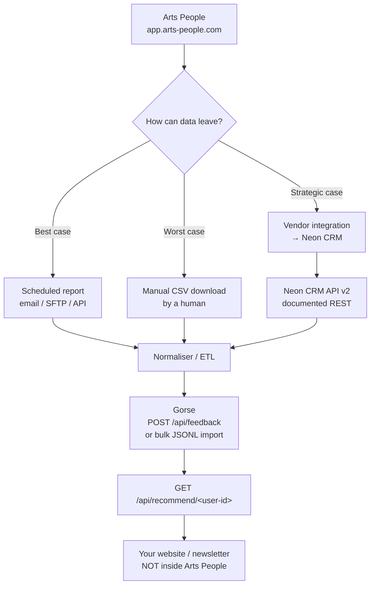

# Connecting Arts People to an External Recommender System

**Status:** Evaluation / initial feasibility
**Date:** 2026-09-15
**Scope:** Can the current Arts People ticketing + patron data be fed to an existing open-source
recommender system via an automated periodic extract — *without* replacing Arts People?

---

## 1. Short answer

**Yes, in principle — with one condition that has not yet been verified.**

The recommender side of this problem is solved: an open-source engine (Gorse) can accept
periodic bulk loads of users, items, and interaction history, and return per-patron
recommendations over a documented REST API. Nothing needs to be built from scratch.

The entire risk sits on the **extraction** side. Arts People is closed SaaS with no publicly
documented API, so whether an *automated* periodic extract is possible depends on a capability
that must be confirmed directly with Neon One. If only manual UI report downloads are available,
then "automated" becomes "a human downloads a file on a rota," which is a very different
proposition.

Nothing in the existing notes (`#Ticketing System.md`, `WordPress.md`, `CurrentSystem.md`)
addresses how data leaves Arts People. That gap is the whole project.

---

## 2. Current state

- **In production:** Arts People by Neon One — ticketing, reserved seating, donations,
  memberships, patron records, box office POS, Neon Pay terminal.
- **Pricing model (current, per Neon One's product page):** $0.99/ticket + transaction fees,
  stated as no monthly subscription dues.
- **Hosted:** `app.arts-people.com` — fully managed SaaS, no database or filesystem access.
- **Existing notes cover:** open-source replacements (osConcert, Odoo, WordPress +
  WooCommerce/FooEvents/Event Espresso), evaluation/survey tooling (LimeSurvey, Formbricks),
  and standalone recommender engines (Gorse, PredictionIO).

The replacement question is explicitly deferred. This document is only about **connecting** to
an external recommender for the current system.

---

## 3. Arts People data access — what was verified

| Path | Status | Notes |
|---|---|---|
| Public Arts People REST API | **Not documented** | No public API found. Neon One's developer centre documents **Neon CRM API v2**, a separate product. API v1 retired 11 July 2026. |
| Arts People help-centre docs on export/API | **Effectively absent** | A support-centre search for "Arts People export" returns one article, and it concerns the Neon CRM API. |
| In-product reporting | **Confirmed to exist** | Product page advertises "Generate reports that support better decisions and grant applications." UI-driven CSV/report export is therefore available. |
| Scheduled / automated delivery (email, SFTP, webhook, feed) | **UNVERIFIED** | No public documentation. This is the single blocking unknown. |
| Arts People → Neon CRM integration | **Confirmed to exist** | Ticket and patron data flows into Neon CRM. Neon CRM has a documented public REST API v2. |
| Partner / enterprise API | **Possible but undocumented** | Cannot be confirmed from public sources. Must be asked about directly. |

---

## 4. The decision fork



**Best case** — Neon One can schedule a recurring report delivery. The pipeline is fully
automated and the project is straightforward.

**Worst case** — only on-demand UI downloads exist. Options are (a) browser automation against
the box office login, which is fragile, likely MFA-blocked, and plausibly contrary to the
agreement; or (b) a manual monthly/weekly download. Option (b) is acceptable for a phase-1
experiment if the cadence expectations are modest.

**Strategic case** — if the theatre also licenses Neon CRM, the vendor integration already moves
Arts People data into a system with a proper public API. That becomes the cleanest extract path,
and it also positions the eventual system replacement.

---

## 5. Recommender engine selection

### Gorse — recommended

Gorse is a good fit and is designed for exactly this pattern:

- **Ingestion:** REST endpoints for users, items, and feedback (`POST /api/feedback`), plus
  first-class **bulk JSONL import** and dump/restore. A nightly or weekly batch load is an
  intended workflow, not a workaround.
- **Retrieval:** `GET /api/recommend/{user-id}`, with category-scoped and session variants.
- **Deployment:** single-node via Docker; SQLite, MySQL/MariaDB, Postgres, or ClickHouse for
  storage. Suitable for a volunteer-run organisation with limited ops capacity.
- **Lifecycle controls:** item TTL and positive-feedback TTL settings — genuinely useful given
  how quickly a community theatre's inventory rotates.
- **Cold start:** non-personalised and item-to-item recommenders run alongside collaborative
  filtering, which matters when show runs are short and purchase data is sparse.
- **Licence:** Apache 2.0.

### PredictionIO — do not use

Apache PredictionIO is **retired**. It became a Top Level Project in October 2017, was retired
in **September 2020**, and the move to the Apache Attic completed in **April 2021**. It is
read-only archives with no security maintenance. `#Ticketing System.md` currently presents it as
a live option; that entry should be removed.

### WordPress-ecosystem options

Only relevant under the deferred "replace the system" scenario. If the theatre ever migrates to
WordPress + WooCommerce, recommendations can be computed locally against the same database
without an external service — a materially simpler architecture. Out of scope for now.

---

## 6. Phase-1 architecture

A periodic extract lands a file, a normaliser maps it to the recommender's schema, and the
engine retrains on its own schedule.

```
Arts People report (CSV)
   │
   ├─ patrons.csv        → users     (opaque patron ID, segment labels)
   ├─ orders.csv         → feedback  (purchase, donation, flex pass, attendance)
   └─ productions.csv    → items     (title, season, genre, tags)
   │
   ▼
Normaliser (small script; dedupe, ID mapping, timestamp parsing)
   │
   ▼
Gorse  →  trains on schedule  →  GET /api/recommend/<user-id>
   │
   ▼
Surface: newsletter / website "Recommended for you"
```

### Data modelling decisions

**Items are productions, not performances, and definitely not seats.** Modelling at
performance- or seat-level explodes the catalogue, guarantees permanent cold start, and produces
recommendations nobody can act on. One item per production per season.

**Users are patrons, keyed by a stable Arts People patron ID.** Expect dirty data: duplicate
patrons, shared household accounts, box-office-created records. Identity resolution is the real
work in this project — more so than anything on the ML side.

**Feedback is purchase-oriented.**

| Arts People event | Recommender mapping | Rationale |
|---|---|---|
| Ticket order | `ticket_purchase`, value = qty or amount, timestamp = order date | Primary positive signal |
| Attendance / scan | `attendance` if available | Strongest signal — separates intent from follow-through |
| Donation | `donation` | Signals affinity, but weak on genre |
| Flex pass / subscription | `subscription` | Strong signal of commitment |

**Item labels are essential and are manual work.** Genre, era, musical-vs-play, family-friendly,
local-vs-touring. With short runs, purchase-only data, and a small subscriber base,
collaborative filtering has little to work with — content/category matching will carry most of
the early results. That tagging has to come from somewhere, and Arts People may not be where you
want to maintain it.

**Feedback TTL:** scope to roughly 2–3 seasons. Older shows should not influence current
recommendations, and the weights degrade naturally if left unbounded.

---

## 7. Practical caveats

- **Privacy.** Send the recommender an opaque per-patron ID, not names or emails, and join back to
  real identities locally. That keeps the recommender copy free of PII even though it holds a
  complete behavioural graph. Also establish retention and deletion rules — the exported copy
  makes the theatre the controller of a second dataset.
- **Contract terms.** Confirm whether the Arts People agreement permits bulk extraction and
  third-party processing of patron data. Do not assume it does.
- **Surfacing.** Assume recommendations cannot be rendered *inside* Arts People. Delivery is via
  your own website, newsletter, or mail-merge. Set expectations accordingly — this is a
  marketing-side feature, not a box-office-side one.
- **Cadence.** A theatre's sales cadence is weekly, not real-time. Nightly or weekly batch loads
  are entirely adequate; do not build streaming infrastructure.
- **No browsing data.** Arts People will not give you page views or abandoned-cart events. You
  get purchases only, which weakens the signal. Website analytics could supplement this if a
  join key exists.
- **Ops burden.** The engine is free; the ongoing cost is the extract, the normaliser, identity
  resolution, and someone who will notice when the pipeline breaks mid-season.

---

## 8. Consider before standing up Gorse

Because this is framed as a *first* possible solution, note that **item-to-item co-occurrence**
— "patrons who bought *The Crucible* also bought…" — is a single SQL query over the same extracted
file. No model training, no second server, no ML infrastructure, no ongoing ops.

For a venue whose realistic wins are content/genre matching and cross-selling, that may capture
most of the available benefit for an evening's work, and it de-risks the harder question of
whether the extract itself is reliable. Gorse becomes the right *second* step, once the pipeline
is proven end to end.

---

## 9. Open questions for Neon One

1. Does Arts People expose a REST or SOAP API or data feed — public, partner-only, or enterprise?
2. Can reports be **scheduled** and delivered automatically (email, SFTP, webhook)? What formats?
3. What does a full export contain at order-line granularity — performance dates, patron IDs,
   attendance/scans, donations, membership status?
4. Is bulk extraction and third-party processing of patron data permitted under our agreement?
5. Does the organisation license **Neon CRM**? If so, the existing Arts People → Neon CRM
   integration plus API v2 is likely the cleanest extraction route.
6. Is there a stable, unique patron identifier that survives merges and household changes?

Questions 1–2 determine whether this project is a small automation task or a manual process with a
script attached.

---

## 10. Corrections applied to existing notes

| File | Issue | Action | Status |
|---|---|---|---|
| `#Ticketing System.md` | Presented PredictionIO as a viable engine. It was retired in Sept 2020 and moved to the Apache Attic in April 2021. | Entry struck through, marked **RETIRED — do not use**, with retirement dates and a pointer to the Apache Attic project list for future candidates. | ✅ Applied |
| `#Ticketing System.md` | Cited *Wp-PostViews* under "Behavioral Recommendations." It is a view counter, not a recommender. | WooCommerce entry split into **rule-based cross-sells** (manual configuration, no ML) and **algorithmic behavioural recommendations** (requires additional tooling). Explicit warning added re: view counters and taxonomy-based "related posts" plugins. | ✅ Applied |
| `#Ticketing System.md` | Drupal entry claimed *Recommender API* / *Computing Framework* "implement collaborative filtering directly." *Recommender API* is an abstraction layer exposing hooks; it ships no trained model. | Reworded with a currency caveat (Drupal 7-era modules; Drupal 10/11 support is the deciding factor) and flagged as the weakest option in the list. | ✅ Applied |
| `#Ticketing System.md` | Recommender section written from a greenfield/self-hosted angle with no reference to the *current* system. | Cross-reference to this document added at the top of the `# Recommender` section. | ✅ Applied |
| `CurrentSystem.md` | Pricing (base subscription ~$31.25/mo, CRM ~$99/mo) does not match the current Arts People page, which states no monthly dues and a flat $0.99/ticket + transaction fees. | **Not changed** — this is a factual question, not an error that can be resolved editorially. Verify against an actual invoice or quote. If the replacement business case depends on those monthly figures, the arithmetic changes materially. | ⚠️ Needs verification |

---

## 11. Recommendation

1. **Ask Neon One questions 1–2 first.** Everything downstream depends on the answer.
2. **Build the co-occurrence report** from a manual export to prove the value quickly and cheaply.
3. **If a scheduled extract is available**, stand up Gorse with the schema in §6 and surface
   results in the newsletter.
4. **If only manual exports are available**, run the experiment on a monthly manual export before
   investing in automation — and revisit Neon CRM as a route to a real API.
5. **Do not plan on rendering recommendations inside Arts People.**

---

## References

- Apache Attic — PredictionIO retirement: <https://attic.apache.org/projects/predictionio.html>
- Neon CRM API v2 documentation: <https://developer.neoncrm.com/getting-started/>
- Gorse recommender engine: <https://github.com/gorse-io/gorse>
- Arts People product information: <https://neonone.com/products/arts-people/>
- Arts People + Neon CRM integration: <https://neonone.com/solutions/arts-people/neon-crm-integration/>
