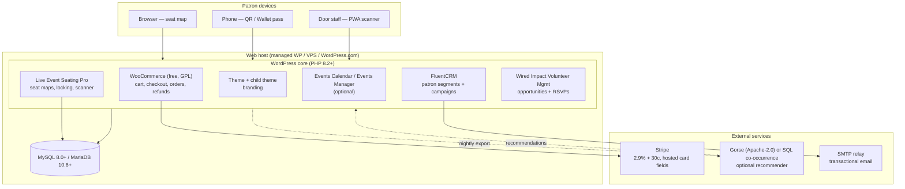

# WordPress Route — Deployment, Charges and Completeness

**Status:** Research complete — decision input
**Date:** 2026-09-18
**Scope:** Answers three questions about the WordPress + WooCommerce option for replacing Arts People:
1. **How is it deployed?**
2. **What are the charges?**
3. **Are all the pieces of the proposed solution actually available?**

**Context:** the requestor already runs their website on WordPress, and `FullSystemRecommendation.md` §8.3 lists this as **"Option C — fastest to first paying theatre, weakest as a product."** This document tests that verdict with current (18 Sep 2026) pricing and licence data.
**Companion documents:** `WordPress.md` (architecture overview), `FullSystemRecommendation.md` (build-vs-buy verdict), `CurrentSystem.md` (Arts People cost model).

---

## 1. Verdict in one page

| Question | Answer |
|---|---|
| **Can it be deployed?** | **Yes, easily — and fastest of every option.** If the theatre already has WordPress, first ticket can be on sale in **1–3 weeks** with no developer. Full build-out (all venues, box office, scanner, CRM) is **4–8 weeks of volunteer/contractor time**. |
| **What does it cost (one theatre)?** | **≈ $350–$700 per year** all-in for software + hosting, plus **2.9% + $0.30 per card transaction**. No per-ticket commission. One-off setup **$0** if self-built, **$299–$1,500** if outsourced. |
| **What does it cost (5 theatres)?** | **≈ $600–$1,500 per year** if licences are bought at the unlimited/agency tiers — the per-theatre marginal cost collapses. |
| **Are all the pieces available?** | **No — about 5 of 7 requirements are available off the shelf.** Missing: **season tickets with seat selection** (nothing in the WordPress ecosystem models entitlement/redemption/seat-retention) and **multi-venue as a first-class hierarchy** (workable, but not native). |
| **Can it be sold to other theatres?** | **Not as a bundled product.** Every serious component is either **GPL** (WordPress, WooCommerce — source obligations on distribution) or **proprietary with an explicit no-resale clause** (Live Event Seating Pro, FooEvents). **Run it as a hosted service and you are fine; ship it as a product and you are not.** |
| **Bottom line** | Use this to **run the requestor's own theatre now** and to validate seat-map UX cheaply. Do **not** make it the basis of the resold product — that remains Option A in `FullSystemRecommendation.md` §8.1. |

---

## 2. How it is deployed

### 2.1 The stack

WordPress is a PHP application on a LAMP-style stack. The theatre's existing site **is already this stack** — the ticketing layer is additive, not a migration.

**Server requirements (WordPress 2026 baseline):** PHP 8.2–8.3, MySQL 8.0+/MariaDB 10.6+, Nginx or Apache with `mod_rewrite`, HTTPS. WooCommerce Subscriptions states PHP 7.4 minimum and WordPress 7.0+ — so target PHP 8.2+ and a current WP release.

### 2.2 Hosting options — where the site lives

You do not need to move the theatre's site. You need hosting that survives an **opening-night burst** (200–500 concurrent users hitting one seat map in the first ten minutes).

| Option | Published price (18 Sep 2026) | Notes |
|---|---|---|
| **Stay where they are** | existing cost | Only viable if the current host is not a $2/mo shared box. Check CPU/MySQL limits before on-sale. |
| **Shared/managed entry — SiteGround** | **StartUp** $2.99/mo promo → renews **$17.99/mo**, 1 site, 10 GB. **GrowBig** $4.99/mo promo → **$29.99/mo**, **unlimited websites**, 50 GB. **GoGeek** $7.99/mo promo → **$44.99/mo**, unlimited sites, 100 GB, staging + Git, **white-label access** | Promo prices are prepaid 12 months. GrowBig/GoGeek "unlimited websites" is the cheapest multi-theatre route. GoGeek's white-label access matters if you resell. |
| **Managed WordPress — Kinsta** | Business single-site ≈ **$59–$70/mo** (≈$700–$840/yr), **+$30/mo per extra site**; Agency from ≈ **$284–$340/mo** | Priced per site. Overkill for one community theatre; suitable only if you operate many. |
| **WordPress.com (SaaS)** | **Business** $25/mo promo → renews **$30/mo** (plugin uploads, SFTP/SSH/WP-CLI/Git, ecommerce tools, MailPoet to 500 subs). **Commerce** $45/mo promo → renews **$57/mo** (WooCommerce-optimised) | Zero server maintenance. You do **not** control the stack — plugin/version constraints apply. Good "no volunteer sysadmin" option. |
| **VPS** (Hetzner/DigitalOcean + RunCloud/ServerPilot) | $6–$20/mo | Cheapest at scale, most ops burden. Only if someone technical is on call. |
| **Local dev** (LocalWP / XAMPP / MAMP) | free | For building and testing seat maps offline before touching production. |

**Never** deploy this stack to production without a staging clone, daily backups, and a tested restore.

### 2.3 Deployment runbook

| Phase | Work | Effort |
|---|---|---|
| **0. Baseline** | Confirm host can run WooCommerce; enable HTTPS; clone to staging; add uptime + backup. | 1 day |
| **1. Commerce layer** | Install WooCommerce (free). Configure tax, currency, refund policy, order emails, HPOS (High-Performance Order Storage). Connect **Stripe** (or WooPayments) with **hosted/iframe card fields** — card data never touches the site, which is what keeps PCI scope at SAQ A. | 1–2 days |
| **2. Seating layer** | Install **Live Event Seating Pro**. Build each auditorium with the drag-and-drop builder (rows, curved rows, sections, GA zones, kill seats, accessible/companion seats). **Export each layout as JSON** — that becomes the reusable venue template. | 3–10 days per venue |
| **3. Events & pricing** | Create a WooCommerce **variable product** per event (price tiers = variations, e.g. VIP/Standard/Balcony). Link the product to the seating plan. Set the **seat-lock duration** and the "no orphan seat" rule per event. | 1 day per event type |
| **4. Tickets & door** | Configure QR mode (one per order vs **one per seat**), the drag-and-drop ticket/PDF designer, email templates, Apple/Google Wallet passes, and the **offline PWA scanner window**. | 1–2 days |
| **5. Box office** | Train staff on **Manual Order Management** (walk-in, phone, comp tickets) and the Booking Manager dashboard. | 0.5 day + training |
| **6. Adjacent modules** | Install FluentCRM (patron segments + campaigns), volunteer plugin, events calendar. Connect an **SMTP relay** — `wp_mail()` via the web host will land in spam during an on-sale. | 2–3 days |
| **7. Hardening & load test** | **Concurrency-test the seat map** (two browsers, same seat, simultaneous checkout). Load-test at expected peak. Verify backups restore. | 2–3 days |
| **8. Go live** | Point the domain, keep staging synced, monitor the first on-sale live. | 1 day |

**Total: ~2–4 weeks of focused work for one venue, 4–8 weeks for a full multi-venue season.**

### 2.4 Multi-venue

WordPress has no native "organisation → venue → auditorium" hierarchy. In practice:

- **One seating layout per auditorium**, exported as a reusable **JSON template** and re-imported per event — this is the plugin's own answer to multi-venue, and it works.
- **The Events Calendar** provides a native **Venue** post type (name, address, map, timezone), which is the closest thing to a venue entity. Live Event Seating integrates with it directly.
- **Sections mode (Pro)** handles balcony/orchestra/pit within a single building **and** multi-room venues ("Main Hall", "Patio") in one map.

**Verdict:** multi-venue is *achievable and reliable*, but it is a **convention** (one layout + one venue taxonomony entry per room), not a modelled hierarchy. There is no versioned seat map tied to a performance, so **editing a venue layout silently affects future events reusing that template** — but not historical orders (those store seat labels on the order line).

### 2.5 Multi-theatre deployment (the "sell to other theatres" case)

| Approach | How | Verdict |
|---|---|---|
| **One WordPress per theatre** | Separate hosting account/site, separate Stripe account (theatre is merchant of record), separate data. | ✅ **Recommended.** Clean isolation, per-tenant export and deletion, no shared-DB tenancy risk. Plugin licences are the constraint (see §5). |
| **WordPress Multisite** | Network of subsites off one install; one licence per subsite in practice; shared database and codebase. | ⚠️ **Not recommended.** WooCommerce tables are created per-subsite, so isolation is *technically* decent, but operations, plugin version skew, backups-per-subsite, and licence counting all become fragile. `FullSystemRecommendation.md` §8.3 reaches the same conclusion. |
| **Single site, many "theatres" as categories** | One storefront, many tenants. | ❌ **Do not.** Patron records, orders and emails would be visible across theatres. This is the data-protection failure mode. |

**Critical multi-tenant point:** whichever route, each theatre must have **its own Stripe account**. Ticket money must never land in a third party's balance — no WordPress plugin solves money transmission, and none is needed as long as you use **Stripe Connect / separate merchant accounts**.

### 2.6 Ongoing operations, security and PCI

- **Updates:** stage first, then production. WordPress, WooCommerce and plugins are the attack surface; a theatre site with WooCommerce is a target.
- **Security:** WAF (host-level or Cloudflare), 2FA on all admin accounts, least-privilege roles (Shop Manager for box office, not Administrator), disable file editing, rate-limit login.
- **PCI:** use **Stripe Elements/Checkout or hosted fields**. Card data then never enters the WordPress database, keeping the theatre on the lightest self-assessment questionnaire. **Never** install a plugin that posts raw card numbers to the site.
- **Backups:** daily, off-host, with a *tested* restore. Restore drills matter more than backup counts.
- **Data protection:** the theatre is the controller of patron data. Per-theatre export and deletion must work — note the Live Event Seating FAQ states **uninstalling the plugin deletes its data**, so it is **not** an archive and migration/export must be planned before any uninstall.
- **Bus factor:** the seating plugin and the volunteer plugin are effectively **single-maintainer projects**. Budget for a contractor, and keep the venue JSON templates exported somewhere safe.

---

## 3. What it costs

All prices as published **18 September 2026**, in the currency shown on the vendor's own page (mostly USD). Promotional hosting prices are 12-month prepay and renew at list.

### 3.1 Software licences (recurring)

| Component | Licence | Price | Covers |
|---|---|---|---|
| WordPress core | GPL, free | **$0** | — |
| WooCommerce core | GPL, free, 0% revenue share | **$0** | cart, checkout, orders, refunds, tax, coupons |
| **Live Event Seating** (seat maps) | Lite **GPL**; Starter/Basic/PRO **proprietary** | Lite **$0** · Starter **$49.99/yr** (1 site) · Basic **$96.99/yr** (5 sites) · **PRO $194.99/yr (unlimited websites)** · Done-For-You venue build **$299** (incl. PRO) | reserved seating, seat locking, scanner, waitlist, seat transfer, GA, sections, wallet passes |
| WooCommerce Subscriptions *(only if selling season passes as recurring billing)* | proprietary | **$279/yr** | recurring billing — **not** seat entitlements (see §4.4) |
| FluentCRM *(patron CRM + campaigns)* | proprietary | **$129/yr** (1 site) · **$249/yr** (5 sites) · **$499/yr** (50 sites) | unlimited contacts, WooCommerce integration, segmentation, automation |
| Wired Impact Volunteer Management | **GPL, free** | **$0** | opportunities, RSVPs, caps, reminder emails, volunteer profiles |
| The Events Calendar — Event Tickets *(alternative to Live Event Seating)* | proprietary | Essentials **$259/yr** · Pro **$399/yr** · **Elite $599/yr** (assigned seating + seat map builder) | alternative stack; Elite is where seat selection lives |
| FooEvents *(alternative seat/ticket stack)* | proprietary, **explicitly not resellable** | Seating extension **$69** · Basic Bundle **$169** · **Premium Bundle $249** · POS Bundle **$399** | WooCommerce ticketing; Seating = rows/tables, not a floor-plan editor |

### 3.2 One-off costs

| Item | Cost |
|---|---|
| Domain (if needed) | ~$12–$20/yr |
| SSL | **$0** (Let's Encrypt, included by every mainstream host) |
| Theme | $0–$100 one-off |
| Venue map build | **$0** (self-built, ~1 day per venue) or **$299** (vendor's Done-For-You service, includes PRO licence) |
| Contractor install/configuration | $500–$2,000 (if not done in-house) |
| Data migration from Arts People | Volunteer time; patron/order history is a CSV exercise, not an automated migration |

### 3.3 Per-transaction costs

| Item | Rate |
|---|---|
| Stripe (standard, domestic cards) | **2.9% + $0.30** |
| WooPayments | ~**2.5–2.9% + $0.30** |
| Stripe Connect platform fee (if you operate for other theatres and charge a platform cut) | **0.25%** starting fee, or **included** when the connected account bears standard pricing |
| Per-ticket platform commission | **$0.00** — this is the entire point |
| Disputes | $15 chargeback fee |

**Worked example — 1,000 tickets at $25:** £/$25,000 gross. Stripe ≈ **$755 (3.0%)**. Software + hosting ≈ **$520/yr**. Total ≈ **$1,275 (5.1%)**. Arts People at $0.99/ticket would charge **$990** in ticket fees alone, *before* card processing and before its base subscription.

### 3.4 Costed scenarios

**Scenario A — the requestor's own theatre, single venue, self-hosted**
| Item | Year 1 | Year 2 |
|---|---|---|
| Hosting (SiteGround StartUp, promo→list) | $36 | $216 |
| Domain | $15 | $15 |
| Live Event Seating **Starter** | $50 | $50 |
| FluentCRM Solo | $129 | $129 |
| Volunteer plugin | $0 | $0 |
| **Total** | **≈ $230** | **≈ $410** |

Add WooCommerce Subscriptions ($279) only if season passes are sold as recurring payments. Add $299 if the venue map is bought as a done-for-you service.

**Scenario B — 5 theatres, one WordPress each, licences at the widest tier**
| Item | Year 1 | Year 2 |
|---|---|---|
| Hosting — SiteGround **GrowBig** (unlimited websites) | $60 | $360 |
| Domains ×5 | $75 | $75 |
| Live Event Seating **PRO** (unlimited websites) | $195 | $195 |
| FluentCRM 5-site | $249 | $249 |
| **Total** | **≈ $579** | **≈ $879** |
| **Per theatre** | **≈ $116** | **≈ $176** |

⚠️ "Unlimited websites" on a single shared hosting account means **shared CPU/RAM/MySQL**. Five theatres going on sale simultaneously would contend. At that point you need separate hosting per theatre — which breaks the single-account saving (5 × $216 = $1,080/yr on StartUp, year 2).

**Scenario C — no-volunteer-sysadmin route (WordPress.com)**
| Item | Year 1 | Year 2 |
|---|---|---|
| WordPress.com **Commerce** | $540 | $684 |
| Live Event Seating PRO | $195 | $195 |
| **Total** | **≈ $735** | **≈ $879** |
Plus Stripe fees. Buys away server maintenance, at the cost of stack control.

### 3.5 Break-even against Arts People

Using the figures already in `CurrentSystem.md` (⚠️ **still unverified — get an actual invoice**): $0.99/ticket + a base subscription ≈ $375/yr + setup $2,500–$10,000.

- Against the **$0.99/ticket** alone: the WordPress stack costs ≈ $520/yr, so it wins at **~525 tickets per year**. A community theatre selling 2,000+ tickets a year saves **$1,500–$2,500 annually**.
- Against the **base subscription + ticket fees**: break-even is well under 200 tickets.
- **The real saving is the setup fee and the commission** — the WordPress route has neither. **The real cost is volunteer maintenance time**: budget 2–6 hours a month for updates, testing and on-sale monitoring. At $50/hour that is **$1,200–$3,600/yr of hidden labour**, which erases the saving if nobody enjoys doing it.
- **Non-monetary losses vs Arts People:** no dedicated box-office phone-booking UX, no arts-specific reporting for grant applications, no vendor support line on opening night, and no single throat to choke when it breaks mid-season.

### 3.6 Costs people forget

1. **Stripe onboarding and KYC** per theatre — expect a volunteer treasurer, and expect it to take weeks.
2. **Email deliverability** — a transactional SMTP relay (often $0–$30/mo) is effectively mandatory.
3. **Support load at on-sale** — the first ten minutes of a popular show will generate phone calls.
4. **Annual licence re-verification** — every price above is a *rental*, and vendors reprice (see §6).
5. **Accessibility** — accessible/companion seat marking is a **Pro** feature (Live Event Seating) or an **Elite** feature (Event Tickets). It is a legal requirement in most jurisdictions, so it is not optional cost.

---

## 4. Are all the pieces available?

### 4.1 Fit against the stated requirements

| # | Requirement | Available? | What provides it | Gap |
|---|---|---|---|---|
| 1 | Ticket sales with **seat-map seat selection** | ✅ **Yes** | Live Event Seating PRO ($195/yr); alternatives: Event Tickets Elite ($599/yr), FooEvents Seating ($69 + core) | None material |
| 2 | **Multiple venues** | ⚠️ **Partly** | JSON layout templates + The Events Calendar Venue taxonomy + Sections mode | No organisation→venue→auditorium model; no versioned seat map per performance |
| 3 | **Season tickets with seat selection** | ❌ **No** | — | **Must be built.** Nothing in WordPress models entitlements, redemption windows, seat retention or exchanges |
| 4 | **Volunteer management** | ⚠️ **Partly** | Wired Impact Volunteer Management (free, GPL, 1,000+ installs, 4.8★, v2.8.2 Jul 2026) | No shift/time-slot granularity, no hours ledger, no perks/recognition milestones, cannot add a volunteer manually |
| 5 | **Marketing / patron CRM** | ✅ **Yes** | FluentCRM ($129–$499/yr) + WooCommerce customers; MailPoet bundled on WordPress.com Business | Patron identity is duplicated across WooCommerce, FluentCRM and the volunteer plugin — no single person record |
| 6 | **Recommender** | ⚠️ **Partly** | WooCommerce **cross-sells/upsells** (manual, free), **related products** by category/tag, YARPP for taxonomy similarity | No behavioural/collaborative filtering. True recommendations need a nightly export to **Gorse (Apache-2.0)** or a one-query **co-occurrence** report |
| 7 | **Sell to other community theatres** | ❌ **Not as a product** | Hosted service only | GPL on the platform + **no-resale clauses** on every paid component (§4.8) |

**Score: 2 fully available, 3 partial, 2 missing.**

### 4.2 Seat maps — genuinely solved

Live Event Seating's feature list is, for a *hosted* deployment, better than the enterprise pricing implies: drag-and-drop venue builder, curved seat rows, sections (balcony/orchestra/pit), freeform polygons, **kill seats** for pillars and aisles, block/hold seats, **accessible + companion seat marking**, tiered pricing via WooCommerce variations, **5-minute (configurable) seat locking** with a visible countdown, live availability polling, **offline-first PWA scanner**, **per-seat QR codes**, Apple/Google Wallet passes, waitlist with timed purchase links, self-service seat release + WooCommerce refunds, seat transfer with audit trail, group "find best seats", manual box-office orders, and a Booking Manager with CSV export.

Two caveats that matter operationally:

- **Seat locking under concurrency is the failure mode of every DIY box office.** The plugin's changelog claims a race-condition fix in v1.2.2. **Test it** with simultaneous checkouts on the same seat before trusting it on an opening night.
- **Uninstall deletes the plugin's data** (vendor FAQ). Treat the WordPress database as the system of record and take your own exports.

### 4.3 Multiple venues — a convention, not a model

Achievable in a day per room, but there is **no `SeatMapVersion` bound to a performance**. Editing the "Main Hall" template after a show has sold affects the *next* event using that template, not historical orders (which store seat labels). That is an acceptable risk at community-theatre scale, and it is a materially weaker data model than `FullSystemRecommendation.md` §9.1 specifies for the product.

### 4.4 Season tickets with seat selection — the hole

**Nothing in the WordPress ecosystem does this.** Verified absences:

- **Live Event Seating** — no subscription, no credit/entitlement, no season package, no pre-sale window, no seat retention. It sells *a seat for an event*.
- **WooCommerce Subscriptions** — recurring billing only. It knows "this customer pays $X/mo". It does **not** know "this customer is entitled to 2 seats in the Balcony for each of 5 named shows, chosen before public on-sale, retained on renewal". Subscriptions cannot express seat-level entitlements.
- **WooCommerce Memberships** — gates content/prices by role; again no seat entitlement.
- **Event Tickets / FooEvents** — ticketing and reserved seating, no season or subscription concept.

**What a season pass would actually require you to build** (i.e. the custom plugin):

| Concept | Why WooCommerce Subscriptions can't express it |
|---|---|
| `SeasonPackage` — 5 shows × 2 seats in a price zone | Subscriptions model price and interval, not entitlement count |
| `Entitlement` + `RedemptionWindow` — subscriber picks before public on-sale, window closes and unsold holds release | Requires custom scheduling and inventory holds outside the cart |
| `SeatAssignment` tied to an entitlement | Seats are WooCommerce order lines, not redeemable rights |
| **Seat retention on renewal** ("keep my seats") | Subscriptions renews a payment; it has no seat context |
| **Pre-sale priority ordering** (longest-tenure subscribers first) | No such notion exists |
| **Partial redemption** (3 of 5 shows) and **upgrades** (Balcony → Stalls, difference charged) | No partial-fulfilment concept |
| **Payment plans** (instalments before the season starts) | Closest to achievable — Subscriptions does instalments |

**Effort:** a competent WordPress developer could build entitlement + redemption + seat retention as a custom plugin in **4–8 weeks**, but it would need to hook into Live Event Seating's private data model (`les_bookings` table), which is **undocumented, unsupported and version-fragile** — and the plugin author is a single maintainer. That is the single biggest technical risk in this route.

### 4.5 Volunteer management — free, partial

The free **Wired Impact** plugin covers the brief's core: opportunities (one-time and flexible), online signup with capacity caps, confirmation and reminder emails, volunteer profiles with participation history, per-volunteer notes. Its documented gaps are exactly the ones a working roster needs: **no per-shift time slot selection**, no hours ledger, no perks/recognition milestones, and volunteers can only be created by self-signup. Extending it means writing PHP against its internals.

### 4.6 Marketing / patron CRM — available, but fragmented

**FluentCRM** is the pragmatic choice: unlimited contacts, WooCommerce integration, segmentation, campaigns, sequences, automation — for **$129/yr per site** (vs Mailchimp-class SaaS at $49/mo for 1,000 contacts on their own comparison). Alternative: **MailPoet Business to 500 subscribers** is bundled with WordPress.com Business.

**The structural weakness:** there is **no unified person record**. A patron is a WooCommerce customer row; a marketing contact is a FluentCRM row; a volunteer is a WordPress user row. The brief's most valuable idea — *a volunteer is usually also a ticket buyer* — is precisely the join that no WordPress plugin gives you.

### 4.7 Recommender — rule-based only, and that is usually enough

Available today with **zero infrastructure**: manual cross-sells/upsells at checkout, "related products" by category/tag, and YARPP for content-taxonomy similarity. For a theatre with short runs and sparse purchase data, **genre/tag matching plus hand-configured cross-sells will outperform collaborative filtering** — the same conclusion as `RecommendationPath.md` §8 and `FullSystemRecommendation.md` §6.2.

Behavioural recommendations require a nightly CSV export into **Gorse (Apache-2.0)** or a single **SQL co-occurrence query** — both technically available, neither packaged as a WordPress plugin. Do not let this drive the platform decision.

### 4.8 Can it be sold to other theatres? — the licence verdict

**No, not as a product.** Two independent blockers:

**(a) The platform is GPL end to end.**
WordPress, WooCommerce, Themes and the free seating plugin are GPL. GPL obligations trigger on **distribution**. So:

- **Operating a hosted service for multiple theatres:** generally no distribution → obligations largely not triggered → **workable.**
- **Selling/shipping the code, or an on-premise install, to another theatre:** that *is* distribution → the theatre receives the corresponding source, including your modifications to GPL parts. Any custom plugin that extends WooCommerce/WordPress is very likely a derivative work and therefore GPL too. **This destroys a closed-source product.**

**(b) Every paid component forbids resale.**
- **Live Event Seating Pro** — "© Md Monir Hossain 2026 — All rights reserved." Proprietary, annual, per-site-count licence. No resale/redistribution right stated.
- **FooEvents** — states explicitly: *"It can be used by you or a client and **cannot be resold or redistributed** in its original or modified state."*
- **Event Tickets / The Events Calendar** — proprietary annual subscription.
- **FluentCRM** — proprietary, licensed by number of websites.

So you cannot bundle any working configuration and sell it. The only lawful routes are: **(1)** run it as a hosted service with each theatre holding its own licences and its own Stripe account; **(2)** negotiate **agency/OEM terms** with each vendor (Live Event Seating's 5-site and unlimited tiers plus GoGeek's "white-label access" hint that an agency arrangement is intended, but get it **in writing**); or **(3)** build your own product — Option A.

**Additional point:** GPL is *survivable* for a hosted service and *fatal* for a closed on-premise product. `FullSystemRecommendation.md` §2 sets out the same mechanic; this route is squarely in the "hosted-only" column.

---

## 5. Component comparison — which seat/ticket stack?

| | **Live Event Seating** (recommended) | **FooEvents** | **Event Tickets (The Events Calendar)** |
|---|---|---|---|
| Seat-map editor | ✅ Full drag-and-drop floor plan | ⚠️ Rows/tables/seating groups | ✅ Custom seating map builder (**Elite only**) |
| Reserved seat selection | ✅ | ✅ | ✅ Elite |
| Sections / balcony / GA | ✅ Pro | ⚠️ Limited | ⚠️ Elite |
| Seat locking + timer | ✅ (configurable) | ✅ | ✅ Elite ("hold timers") |
| Offline scanner | ✅ Pro (PWA, <5 ms, syncs) | ✅ Free check-in apps (iOS/Android) | ✅ Pro (check-in app) |
| QR tickets / wallet passes | ✅ Pro | ✅ | ✅ |
| Waitlist / seat transfer / refunds | ✅ Pro | ⚠️ Partial | ⚠️ Partial |
| Manual box-office orders | ✅ Pro | ✅ POS add-on | ⚠️ |
| Multi-date events | ✅ Pro | ✅ Multi-day add-on | ✅ recurring events |
| Licence tiers | Lite free · **$49.99 / $96.99 / $194.99 per year** | **$69** extension; **$249** Premium Bundle | **$259 / $399 / $599 per year** |
| Sites per licence | 1 / 5 / **unlimited** | (per licence, no resale) | per subscription |
| Maturity | **Young** (published Dec 2025; 20+ installs; 11 five-star reviews; single maintainer) | **Mature** (11 yrs, 17,000 customers, 23 M check-ins) | **Mature** (major vendor, now Liquid Web) |
| Best for | Cheapest path to a real floor plan | Lowest-risk ticketing, weaker seating | If you want a full events platform incl. email campaigns |

**Recommendation:** **Live Event Seating PRO ($194.99/yr, unlimited websites)** — the unlimited-websites tier is deliberately priced for exactly this multi-site case, and the feature list is the closest match to the brief. **Mitigate the youth/single-maintainer risk** with: exported JSON layouts, your own database backups, and a named contractor. If risk appetite is low, **FooEvents Premium Bundle ($249/yr)** is the mature alternative — but check its seating editor against a real theatre floor plan before committing, and remember its licence is explicitly non-resaleable.

---

## 6. Risks and due-diligence checklist

**Licence / commercial**
- [ ] Get **written confirmation** from the Live Event Seating author that a Pro licence may be used on client sites you host, and whether agency/OEM terms exist.
- [ ] Confirm each vendor's terms permit **your** multi-theatre hosting model (FooEvents says clients are fine, resale is not).
- [ ] Do not ship GPL code inside a closed product. Get a legal opinion before any on-premise offer.

**Technical**
- [ ] **Concurrency-test seat locking** — two simultaneous checkouts on the same seat. Repeat 20 times.
- [ ] Confirm **HPOS** (WooCommerce High-Performance Order Storage) and **Cart/Checkout block** compatibility for the seating plugin — not stated in its vendor material.
- [ ] Confirm seat data is **not deleted** by an accidental uninstall in production (vendor FAQ says it is).
- [ ] Export every venue layout as JSON and store it outside WordPress.
- [ ] Load-test at expected opening-night concurrency on the chosen host tier.
- [ ] Test the offline PWA scanner in a real dead-zone venue.
- [ ] Verify **transactional email** deliverability through an SMTP relay (SPF/DKIM/DMARC).

**Operational**
- [ ] Name the person who updates it, and the contractor who fixes it at 7pm on opening night.
- [ ] Per-theatre Stripe onboarding plan (KYC, bank account, treasurer who may have left).
- [ ] Data-protection: per-theatre export and deletion; the theatre is controller, you are processor.
- [ ] Accessibility: confirm accessible + companion seat marking is in the tier you buy (Pro/Elite).
- [ ] Annual licence re-verification (vendors reprice; see `FullSystemRecommendation.md` §7).

---

## 7. Recommendation

1. **Deploy this route for the requestor's own theatre, now.** It is the fastest, cheapest way to stop paying $0.99/ticket, and the seat-map UX can be validated in weeks. Buy **Live Event Seating PRO** ($194.99/yr), stay on the existing WordPress site (upgrade the host if it is shared entry-level), connect **Stripe**, and add **FluentCRM** for patron email.
2. **Do not buy WooCommerce Subscriptions expecting season tickets.** It will not deliver seat selection. Either negotiate the season-ticket workflow manually for the first year (box office assigns subscriber seats during a private pre-sale window) or fund the custom entitlement plugin knowingly.
3. **Do not attempt to resell this stack as a product.** GPL plus no-resale clauses make it a hosted-service-only play. If the business goal is selling to other theatres, Option A in `FullSystemRecommendation.md` §8.1 remains the answer, and this deployment becomes its **design-validation vehicle** and its first reference customer.
4. **If you do host for other theatres**, do it as **one WordPress per theatre**, each with its own Stripe account and its own plugin licences — or a written agency agreement covering licence stacking.
5. **Re-run this cost table each year.** Every price here is a subscription, and the seating plugin is young enough that its pricing and licence terms may change.

**Cost of the recommendation for the requestor's own theatre:**

| | Year 1 | Year 2 |
|---|---|---|
| Hosting + domain (SiteGround StartUp) | $51 | $231 |
| Live Event Seating PRO (unlimited sites) | $195 | $195 |
| FluentCRM Solo | $129 | $129 |
| Volunteer plugin | $0 | $0 |
| **Total** | **≈ $375** | **≈ $555** |
| Per card transaction | 2.9% + $0.30 | 2.9% + $0.30 |
| Per-ticket commission | **$0.00** | **$0.00** |

---

## 8. References (all retrieved 2026-09-18)

**Seating / ticketing**
- Live Event Seating – Lite (GPL, WP.org: v1.3.1, published Dec 2025, 20+ installs, 11 five-star reviews): <https://wordpress.org/plugins/live-event-seating-lite/>
- Live Event Seating – feature list and Premium pricing ($49.99 / $96.99 / $194.99 per year; DFY $299): <https://macmonir.net/wordpress-plugins/wordpress-seating-chart-plugin/>
- Live Event Seating – full feature reference: <https://macmonir.net/wordpress-plugins/wordpress-seating-chart-plugin/wordpress-seating-chart-features/>
- FooEvents pricing ($169 / $199 / $249 / $399 bundles): <https://www.fooevents.com/pricing/>
- FooEvents Seating ($69; licence: "cannot be resold or redistributed"): <https://www.fooevents.com/products/fooevents-seating/>
- Event Tickets / The Events Calendar (Essentials $259, Pro $399, Elite $599 per year incl. seating map builder): <https://www.liquidweb.com/software/the-events-calendar/event-tickets/>

**Commerce / payments**
- WooCommerce pricing (core free, 0% revenue share; extensions $29–$299/yr; hosting $25–$350/mo typical): <https://woocommerce.com/pricing/>
- WooCommerce Subscriptions ($279/yr): <https://woocommerce.com/products/woocommerce-subscriptions/>
- Stripe pricing (2.9% + 30¢ domestic; Connect 0.25% platform pricing, or included; $15 disputes): <https://stripe.com/pricing>

**Hosting**
- SiteGround WordPress hosting (StartUp/GrowBig/GoGeek; promo and renewal prices): <https://www.siteground.com/wordpress-hosting.htm>
- Kinsta pricing (Business per-site, Agency, add-ons): <https://kinsta.com/pricing/>
- WordPress.com pricing (Personal/Premium/Business/Commerce): <https://wordpress.com/pricing/>

**Adjacent modules**
- Wired Impact Volunteer Management (GPL, free, 1,000+ installs, v2.8.2): <https://wordpress.org/plugins/wired-impact-volunteer-management/>
- FluentCRM pricing ($129 / $249 / $499 per year): <https://fluentcrm.com/pricing/>

**Prior internal documents**
- `FullSystemRecommendation.md` — build-vs-buy verdict, licence classes, §8.3 Option C, §9 hard domain problems, §12 corrections
- `WordPress.md` — architecture and hosting overview
- `RecommendationPath.md` — extract-and-recommend analysis; "start with co-occurrence" conclusion
- `CurrentSystem.md` — Arts People cost model (⚠️ unverified against an actual invoice)
